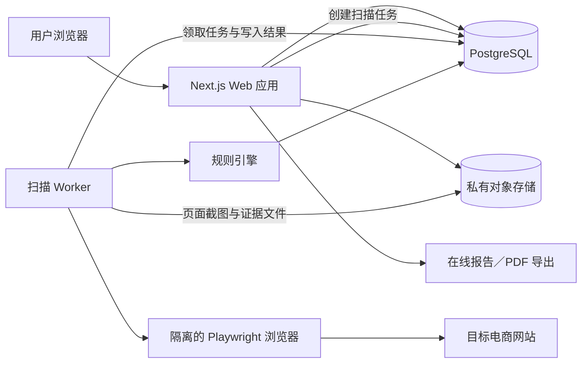

# 日本电商网站在地合规检查工具｜MVP 技术方案

> 更新时间：2026-08-31
>
> 文档版本：v0.1
>
> 上一版：无（首次创建）
>
> 状态：第一版技术基线

## 1. 结论摘要

MVP 采用 **Web SaaS + 独立扫描 Worker**，不采用 Electron 作为主应用。

核心技术选择：

| 部分 | MVP 选择 | 主要理由 |
|---|---|---|
| 用户端与管理端 | Next.js + React + TypeScript | 可复用现有 React Demo，同时承载页面、登录和轻量 API |
| 网站扫描 | Node.js + TypeScript + Playwright（Chromium） | 能读取动态渲染页面、记录最终 URL、正文和截图证据 |
| 规则引擎 | 版本化规则定义 + 确定性 TypeScript 判断器 | 结果可测试、可解释、可追溯，不把法律判断交给黑箱模型 |
| 数据库 | PostgreSQL | 保存项目、任务、页面事实、规则版本、检查结果和报告元数据 |
| 文件存储 | S3 兼容的私有对象存储 | 保存用户上传截图、页面截图和导出报告 |
| 异步任务 | MVP 使用 PostgreSQL 任务表 | 先避免额外维护 Redis；并发需求明确后再升级专用队列 |
| OCR | 可替换的 OCR 适配层 | 先验证本地日文 OCR，准确率不足时再接入云端 OCR |
| 部署 | Docker 容器，日本区域优先 | 隔离扫描环境，便于限制网络、资源和运行权限 |

Electron 保留为未来的“本地扫描助手”候选，只在必须使用客户本机登录状态、本机 IP、证书或本地文件时考虑。

## 2. 已确认事实、技术判断与待确认项

### 2.1 已确认事实

- 产品面向日本市场的中文电商商家和代理运营人员。
- MVP 检查公开网页，并允许用户上传已脱敏的最終確認画面截图。
- 单次最多读取约 30 个页面，目标是在约 5 分钟内生成风险报告。
- 检查结果必须保存页面证据、规则版本、官方依据和判断状态。
- 系统不得提交表单、创建订单、付款或访问本机及内网地址。
- 当前 React Demo 的页面结构和核心流程可以继续复用。

### 2.2 技术判断

- 扫描任务属于耗时、不稳定、需要重试的后台任务，不应放在普通网页请求中同步执行。
- 用户输入任意 URL 会引入 SSRF（服务端请求伪造）和恶意网页风险，扫描程序必须与主应用隔离。
- 规则判断需要可重复验证，因此“事实提取”和“规则判断”必须分开。
- MVP 不需要微服务体系；一个 Web 应用、一个扫描 Worker 和一个 PostgreSQL 数据库足够。
- AI 可以将来辅助页面分类或生成说明草稿，但不应成为“通过／发现问题”的唯一判断依据。

### 2.3 待确认项

- 正式部署使用哪一家云服务，以及是否必须限定日本区域存储。
- 用户上传截图、页面截图和报告的保存期限及删除方式。
- 首轮试用是否需要正式登录，还是仅限邀请用户使用。
- 日文 OCR 的最低可接受准确率，以及本地 OCR 是否能够达到该标准。
- PDF 报告是否需要代理公司 Logo、客户名称等白标能力。

## 3. 系统总体结构



### 3.1 为什么要拆成 Web 应用与扫描 Worker

- Web 应用负责稳定、快速的用户操作，不被某个网站超时或崩溃拖住。
- Worker 可以单独限制 CPU、内存、网络、并发数和最长执行时间。
- 扫描失败可以重试，Web 应用仍能正常显示进度和已有结果。
- 未来扫描量增加时，只扩充 Worker，不必复制整个 Web 应用。

## 4. 代码组织建议

继续使用一个 Git 仓库，通过 npm workspaces 管理：

```text
apps/
  web/                 # Next.js 用户界面、登录、项目与报告 API
  worker/              # Playwright 扫描、页面发现、OCR 和任务执行
packages/
  rules/               # R01～R30 规则定义、版本和判断器
  shared/              # 类型、URL 校验、错误码和公共工具
  report/              # 在线报告与导出模板
tests/
  fixtures/            # 固定 HTML、截图和模拟网站
  benchmarks/          # 10 个基准网站的人工标注结果
```

不建议 MVP 一开始拆成多个独立仓库或大量微服务。

## 5. 主要模块

### 5.1 Web 应用

负责：

- 用户登录和访问控制；
- 创建项目、填写 5 个业务问题；
- 上传已脱敏截图；
- 创建扫描任务并显示进度；
- 查看、筛选和导出报告；
- 查看历史检查记录和发起复查。

普通项目与报告 API 可以使用 Next.js Route Handlers。扫描本身不得在 Route Handler 中直接运行。

### 5.2 扫描 Worker

负责：

- 领取待执行任务并更新心跳；
- 再次校验目标 URL 和解析后的 IP；
- 启动独立浏览器上下文；
- 发现并抓取最多 30 个关键页面；
- 提取标题、正文、链接、字段和截图；
- 调用 OCR 处理用户上传截图；
- 生成结构化事实并交给规则引擎；
- 保存结果、错误原因和执行指标。

MVP 默认每个 Worker 同时执行 1～2 个网站，以稳定性优先。

### 5.3 页面发现器

优先顺序：

1. 首页导航与页脚；
2. 包含「特定商取引法」「返品」「送料」「プライバシー」等关键词的站内链接；
3. 商品详情页、联系页和利用规约；
4. `sitemap.xml` 中同站点的候选页面。

只访问同一注册域及明确允许的子域；跨域链接只记录，不自动继续抓取。

### 5.4 规则引擎

规则引擎分为三层：

1. **页面证据**：原始 URL、页面标题、正文片段、截图位置和抓取时间；
2. **结构化事实**：例如“发现送料字段”“只显示品牌名”“没有退货期限”；
3. **规则结果**：根据业务问卷、规则版本和事实输出通过、发现问题、无法自动确认或不适用。

每条规则必须包含：

- 唯一编号与版本；
- 适用条件；
- 所需事实；
- 四种结果的判断条件；
- 风险等级；
- 官方依据；
- 用户可见说明和整改建议模板；
- 自动测试样例。

### 5.5 OCR

- OCR 通过统一接口调用，避免业务代码绑定某个供应商。
- 第一轮先用 20 张已脱敏的日文结算页截图验证本地 OCR。
- 如果关键字段召回不足，再比较云端 OCR；接入外部服务前必须确认数据处理地区、保存策略和费用。
- OCR 低把握度或截图不清时，规则结果必须是“无法自动确认”。

## 6. 核心任务流程

1. 用户提交 URL、项目名称和业务问卷。
2. Web 应用完成 URL 格式检查，并创建扫描任务。
3. Worker 原子领取任务，记录规则版本和开始时间。
4. Worker 校验 DNS、IP 和每次跳转，阻止内网及危险目标。
5. Playwright 在隔离环境中发现和抓取页面。
6. 提取器将页面内容转换为结构化事实。
7. 规则引擎执行 R01～R30，并保存证据与判断原因。
8. Web 应用读取进度，任务完成后展示在线报告。
9. 用户可重新检查；新结果作为独立版本保存，不覆盖旧结果。

任务状态统一使用：`queued`、`running`、`succeeded`、`partially_succeeded`、`failed`、`cancelled`。

## 7. 数据设计原则

MVP 需要的主要数据对象：

| 对象 | 保存内容 |
|---|---|
| User | 用户身份和最小必要的账户信息 |
| Project | 项目名称、网站和业务问卷 |
| ScanJob | 状态、进度、重试次数、错误和规则版本 |
| PageSnapshot | 最终 URL、标题、正文摘要、抓取时间和文件位置 |
| ExtractedFact | 事实类型、值、证据位置和提取把握度 |
| RuleVersion | 规则定义、来源、发布日期和校验值 |
| Finding | 规则结果、风险等级、证据、说明和整改建议 |
| UploadedAsset | 脱敏截图的存储位置、类型、大小和删除时间 |
| Report | 报告版本、生成时间和导出文件位置 |

结构稳定、需要查询的数据使用关系字段；业务问卷、证据定位等变化较快的数据可以使用 PostgreSQL `jsonb`，但仍需定义固定结构并做输入校验。

## 8. 安全与隐私

### 8.1 URL 与 SSRF 防护

- 只接受 `http` 和 `https`。
- 规范化 URL，拒绝用户名密码、异常端口和非网页协议。
- DNS 解析后阻止回环、私有、链路本地、保留地址及云元数据地址。
- 每次跳转都重新校验目标域名与 IP，防止 DNS 重绑定和跳转绕过。
- 扫描容器通过网络策略禁止访问数据库管理端口、宿主机和内部服务。

### 8.2 浏览器隔离

- Playwright Worker 使用独立容器、非 root 用户和 Chromium sandbox。
- 不使用 `--no-sandbox`，生产环境启用适合浏览器的 seccomp 配置。
- 每个任务使用新的 BrowserContext，不复用 Cookie、缓存或登录状态。
- 限制 CPU、内存、磁盘、页面数、响应大小、下载和总执行时间。
- 不提交表单、不点击购买按钮、不允许下载可执行文件。

### 8.3 文件与个人信息

- 对象存储默认私有，通过短期签名 URL 访问。
- 上传时限制文件类型、大小和像素尺寸，并检查真实文件格式。
- 数据库和对象存储启用传输及静态加密。
- 日志不记录完整页面正文、用户上传图片或签名 URL。
- 正式试用前必须确定保存期限；建议默认 30 天后删除上传截图，报告和结构化结果可由用户主动删除。

## 9. 异步任务与失败处理

MVP 使用 PostgreSQL 任务表，并通过行锁保证多个 Worker 不会领取同一个任务。PostgreSQL 官方说明 `SKIP LOCKED` 适合多个消费者处理队列式表。

处理原则：

- 网络超时、临时 DNS 错误最多自动重试 2 次；
- URL 被安全策略拒绝不重试；
- 单个页面失败不阻止其他页面和可用规则生成结果；
- 整个网站不可访问时，输出明确失败原因，不生成误导性“通过”报告；
- Worker 中断后，超过心跳时限的任务可以被安全地重新领取。

当并发扫描达到 PostgreSQL 任务表的维护上限，或出现复杂调度需求时，再评估 Redis + BullMQ 等专用队列。

## 10. 部署建议

MVP 建议部署在日本区域，包含：

- 1 个 Next.js Web 容器；
- 1 个扫描 Worker 容器；
- 托管 PostgreSQL；
- 私有对象存储；
- HTTPS、域名和基础监控。

不建议把 Playwright 扫描任务部署为短时 Serverless Function。扫描耗时、浏览器依赖和资源波动更适合常驻 Worker 容器。

初期不要求 Kubernetes。单机 Docker 或云平台容器服务已经足够；当任务量、容灾或团队规模明显增加后再升级。

## 11. 测试与发布门槛

### 11.1 自动测试

- **规则单元测试**：R01～R30 每条至少覆盖通过、发现问题和证据不足；条件规则补充不适用。
- **页面提取测试**：使用固定 HTML 覆盖日文编码、跳转、动态渲染和关键字段提取。
- **安全测试**：覆盖本机、内网、IPv6、重定向、DNS 重绑定样例和超大响应。
- **Worker 集成测试**：任务领取、心跳、重试、部分成功和中断恢复。
- **API 测试**：权限隔离、输入校验、进度和报告字段。
- **端到端测试**：从创建检查到查看报告的完整流程。
- **基准回归**：10 个人工标注网站在规则或提取器更新后全部复核。

### 11.2 发布门槛

- 所有自动测试和构建通过；
- 30 条规则具有版本和官方来源；
- 已确认的高风险问题在基准集中不漏报；
- SSRF 和浏览器隔离测试通过；
- 无证据的规则不会输出“通过”；
- 报告记录本次使用的规则版本；
- 上传截图的脱敏提醒、访问控制和删除机制可用。

## 12. 日志与监控

每次扫描生成唯一 `scan_id`，日志只记录结构化运行信息：

- 当前阶段、页面数量和耗时；
- 成功、部分成功和失败数量；
- 超时、浏览器崩溃和安全拦截原因；
- 每条规则执行耗时和结果状态；
- Worker 心跳和任务积压数量。

首版至少设置以下告警：扫描失败率突然升高、任务等待过久、Worker 无心跳、数据库或对象存储不可用。

## 13. 实施顺序

### 阶段 A：技术骨架

- 建立 Web、Worker、rules 和 shared 四个工作区；
- 接入 PostgreSQL 和对象存储；
- 实现创建任务、进度和模拟结果链路。

完成标志：当前 Demo 可以通过真实 API 创建任务并读取模拟报告。

### 阶段 B：最小真实扫描

- 完成 URL 安全校验和隔离浏览器；
- 发现首页、特商法、隐私、配送和退货页面；
- 保存页面事实和截图证据；
- 先实现 R01、R02、R09、R14、R27 五条代表性规则。

完成标志：对测试网站生成包含真实页面证据的报告。

### 阶段 C：完整 MVP

- 扩展至 R01～R30；
- 接入截图上传和 OCR；
- 完成报告导出、复查和历史记录；
- 建立 10 个网站的人工基准集。

完成标志：达到《MVP 产品设计文档》第 13 节的发布门槛。

### 阶段 D：小范围试用

- 邀请少量代理运营人员检查真实公开网站；
- 记录漏报、误报、扫描失败和难以理解的建议；
- 优先修正规则和提取准确性，不扩展国家或专项商品法规。

完成标志：试用用户能够独立完成检查，并认为至少 80% 的问题可以直接进入整改。

## 14. 本版明确不采用的方案

| 方案 | 本版决定 | 原因 |
|---|---|---|
| Electron 主应用 | 不采用 | 增加桌面分发与安全维护，但没有解决集中规则管理和异步扫描问题 |
| 浏览器内直接抓取目标网站 | 不采用 | 受浏览器跨域和安全模型限制，也无法可靠执行长任务 |
| 扫描逻辑运行在 Web 请求中 | 不采用 | 超时或浏览器崩溃会直接影响用户请求 |
| 一开始使用 Kubernetes | 不采用 | MVP 规模下增加运维复杂度，没有对应收益 |
| 一开始拆多个仓库／微服务 | 不采用 | 降低开发和测试效率 |
| 由大模型直接判定合规 | 不采用 | 难以稳定回归、解释来源和控制误判 |
| 使用单一合规分数 | 不采用 | 会制造虚假精确感，与产品设计原则冲突 |

## 15. 主要风险与应对

| 风险 | 影响 | MVP 应对 |
|---|---|---|
| 网站反爬、人机验证或登录墙 | 无法取得完整页面 | 明确显示无法确认；允许用户补充页面或截图，不绕过访问限制 |
| 前端结构差异大 | 关键页面或字段漏提取 | 关键词、链接结构和 sitemap 多路发现；用基准网站持续回归 |
| 动态页面耗时过长 | 超过 5 分钟目标 | 页面与总任务超时、资源拦截、最多 30 页、部分成功报告 |
| OCR 错误 | 结算页误判 | 保存原图证据和把握度；低把握度不判通过 |
| 法规或官方指引更新 | 旧规则继续运行 | 规则版本化、来源访问日期和发布前回归 |
| 恶意 URL 或网页 | 探测内网或攻击浏览器 | SSRF 防护、网络隔离、非 root、sandbox、资源限制 |
| 报告被误当成法律认证 | 用户错误依赖 | 固定法律提示，避免“违法／完全合规”等确定性表述 |

## 16. 技术决策记录

| 决策 | 选择 | 状态 |
|---|---|---|
| 产品形态 | Web SaaS | 已确认 |
| Electron | 不作为 MVP 主方案 | 已确认 |
| 前端 | Next.js + React + TypeScript | 第一版基线 |
| 扫描 | 独立 Node.js + Playwright Worker | 第一版基线 |
| 数据库 | PostgreSQL | 第一版基线 |
| 任务队列 | 先使用 PostgreSQL 任务表 | 第一版基线 |
| 文件 | 私有对象存储 | 第一版基线 |
| OCR | 先做准确率实验，再确定实现 | 待验证 |
| 云服务与部署区域 | 日本区域优先，供应商未定 | 待确认 |
| 数据保存期限 | 建议截图 30 天，最终期限未定 | 待确认 |

## 17. 官方技术依据

以下来源访问日期均为 2026-08-31：

1. [Electron 官方介绍](https://www.electronjs.org/docs/latest/)
2. [Electron 安全指南](https://www.electronjs.org/docs/latest/tutorial/security)
3. [Next.js Route Handlers](https://nextjs.org/docs/app/getting-started/route-handlers)
4. [Next.js 部署方式](https://nextjs.org/docs/app/getting-started/deploying)
5. [Playwright 浏览器支持](https://playwright.dev/docs/browsers)
6. [Playwright Docker 与爬虫隔离建议](https://playwright.dev/docs/docker)
7. [PostgreSQL `SELECT` 与 `SKIP LOCKED`](https://www.postgresql.org/docs/17/sql-select.html)
8. [PostgreSQL JSON 类型](https://www.postgresql.org/docs/17/datatype-json.html)
9. [OWASP SSRF 防护指南](https://cheatsheetseries.owasp.org/cheatsheets/Server_Side_Request_Forgery_Prevention_Cheat_Sheet.html)
10. [Docker Engine 安全说明](https://docs.docker.com/engine/security/)

## 18. 下一份配套文档

在开始真实后端开发前，应优先创建《MVP 检查规则明细表》，把 R01～R30 的输入事实、判断条件、四种结果、证据要求和测试样例逐条固定。

随后再创建一份较短的《阶段 B 开发任务清单》，把最小真实扫描拆成可独立提交和验收的开发任务。

